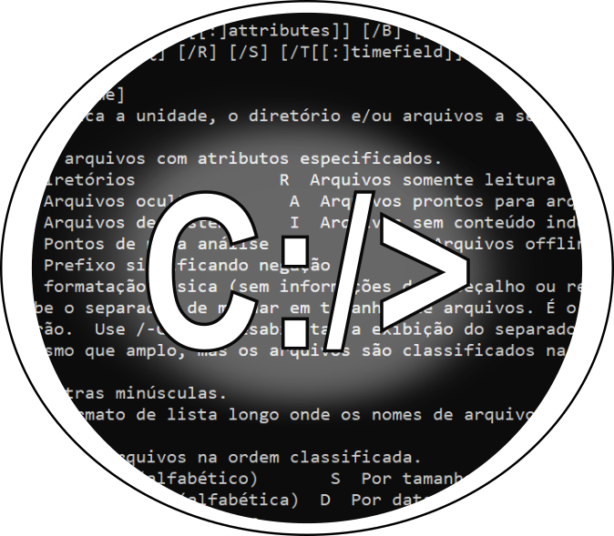

<h1 align="center">Batch Script Overview</h1>

<h3 align="center">A curious repository about batch commands, scripts and examples</h3>

<a href="#license">License</a> • 
<a href="#author">Author</a> •
<a href="#readme-language">README Language</a>

## Index

* [Introduction](#introduction)
* [Some Commands](#some-commands)
* [Working with Scripts](#working-with-scripts)
* [Scripts Examples](#scripts-examples)

## Introduction

## Some Commands

## Working with Scripts

## Scripts Examples

## License

## Author

Rafael Augusto Mota

## README Language

[Português](./README-pt-br.md) | [Español](README-es.md) | [English](README.md) 
